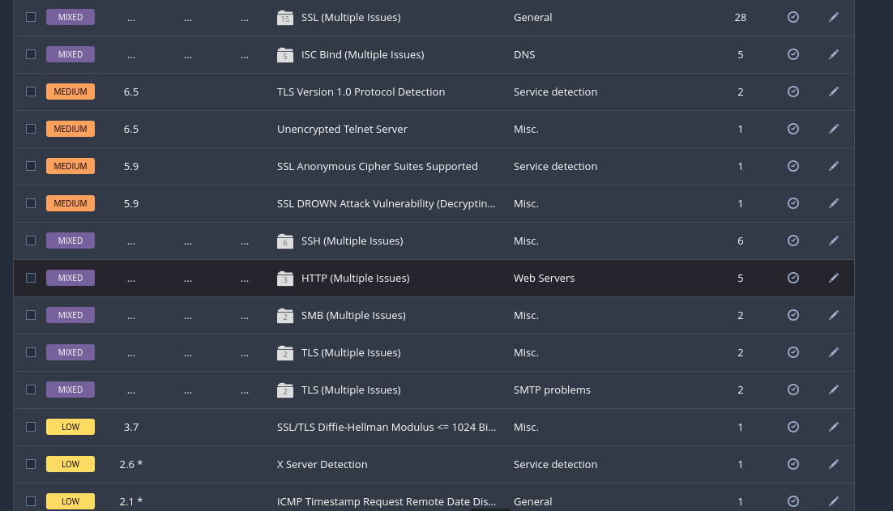
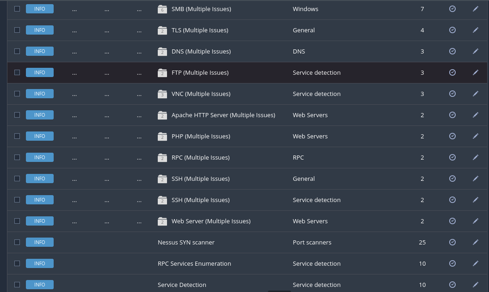
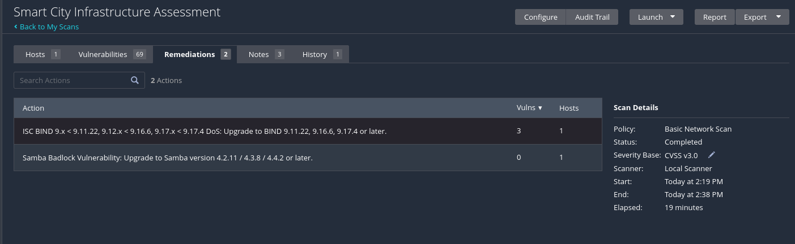
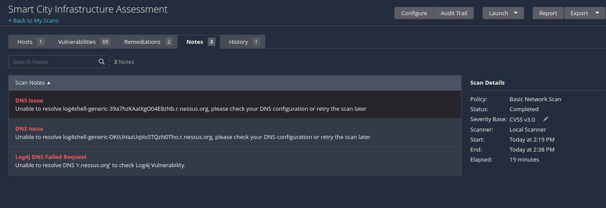
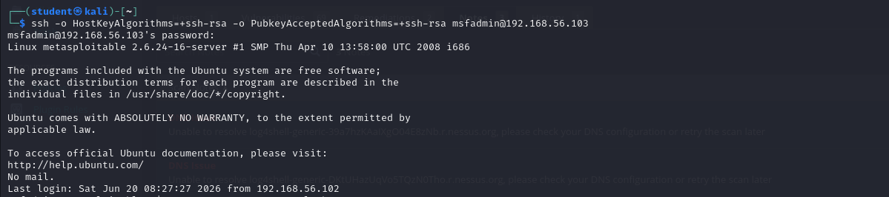
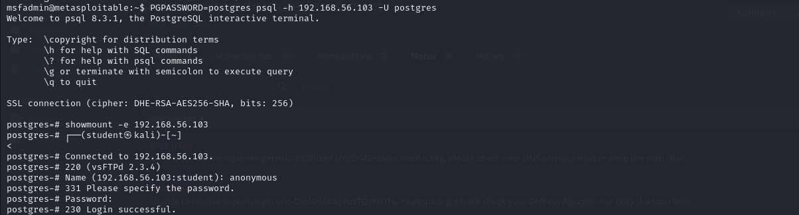
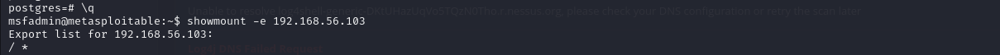
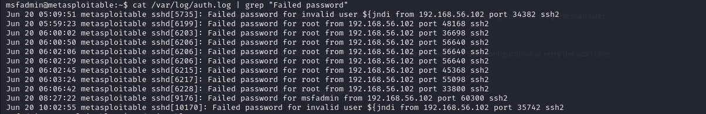
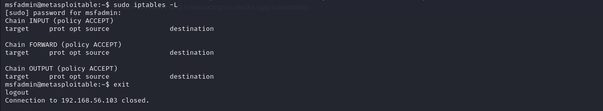

# Screenshots

Screenshots taken during the Smart City Infrastructure Assessment.

## Screenshot Index

| Filename | Description |
|---|---|
| `01-nmap-scan.png` | Nmap scan results showing 23 open ports |

| `02-nessus-dashboard.png` | Nessus scan summary — 69 vulnerabilities |

| `03-nessus-critical.png` | Critical findings in Nessus |

| `04-nessus-medium-low.png` | Medium and low findings |

| `05-nessus-info.png` | Informational findings |

| `06-nessus-remediations.png` | Nessus recommended remediations |

| `07-nessus-notes.png` | Scan notes — DNS/Log4Shell limitation |

| `08-ftp-anonymous.png` | Anonymous FTP login confirmed |

| `09-ssh-default-creds.png` | SSH login with default credentials |

| `10-postgresql-access.png` | PostgreSQL default credential access |

| `11-nfs-export.png` | NFS root filesystem export |

| `12-auth-logs.png` | Auth logs including Log4Shell probes |

| `13-iptables-empty.png` | Empty firewall — no rules |

> Add your screenshots from the assessment here and reference
> them in the walkthrough files for a complete documented report.