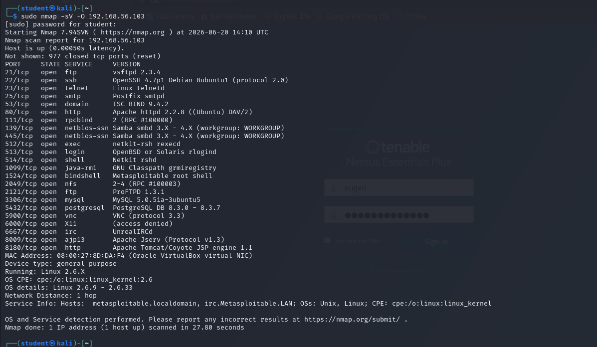
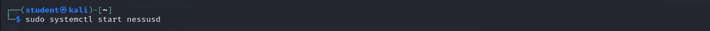
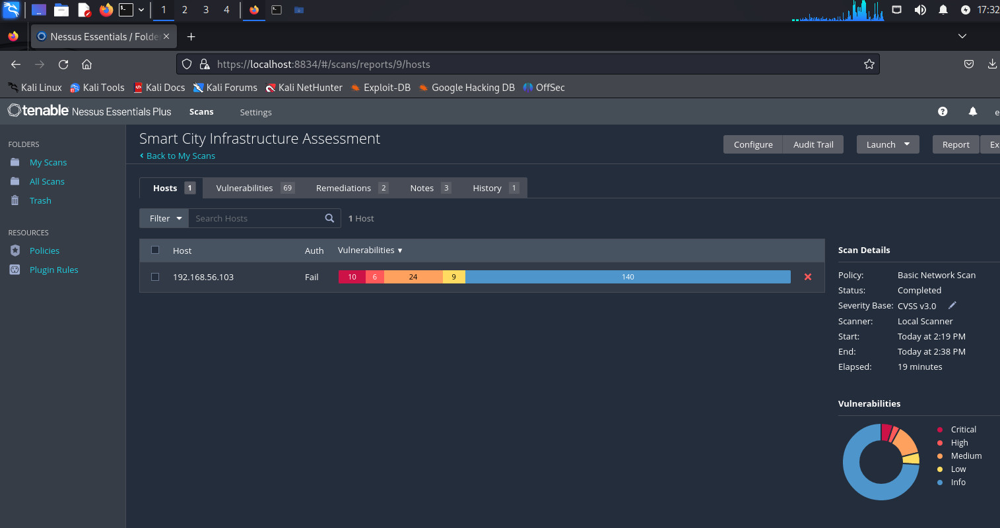
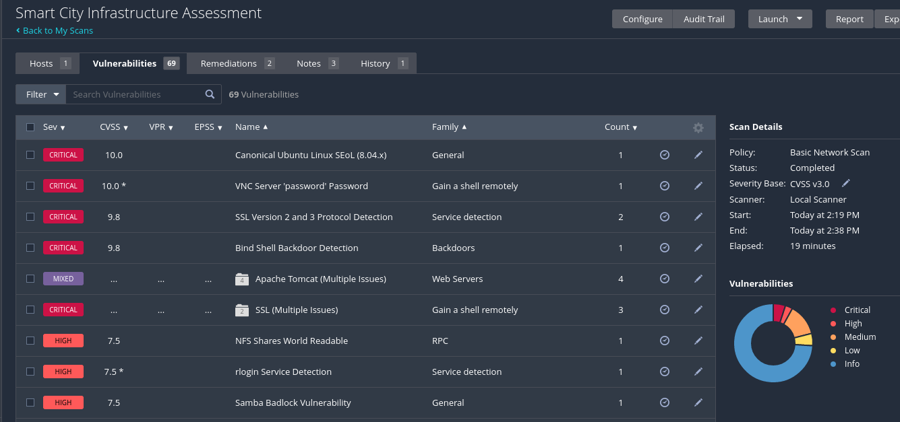
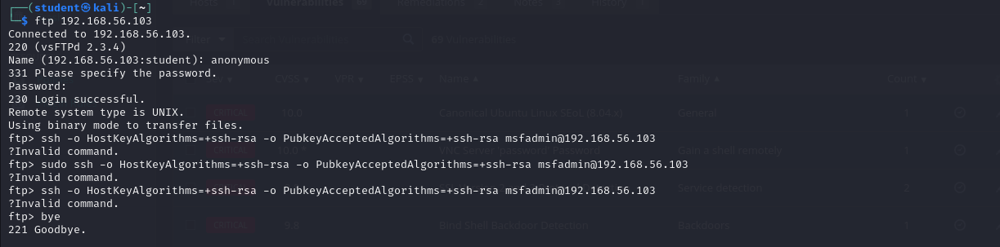
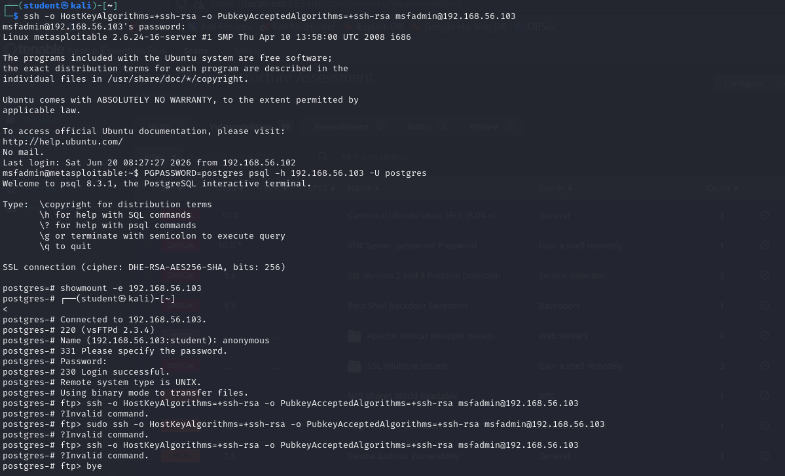
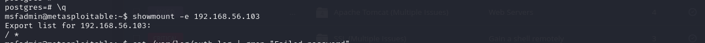
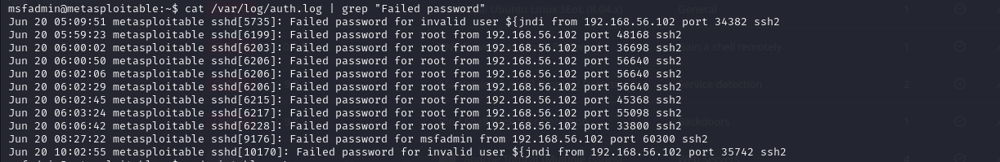

# Screenshots

This folder contains screenshots taken during the vulnerability assessment.

## Suggested Screenshots to Add

| Filename | Description |
|---|---|
| `01-nmap-scan.png` | Nmap scan results showing 23 open ports |

| `02-nessus-dashboard.png` | Nessus scan summary — 70 vulnerabilities |

| `03-nessus-critical.png` | Critical findings in Nessus |

| `04-ftp-anonymous.png` | Anonymous FTP login success |

| `05-postgresql-access.png` | PostgreSQL default credential access |

| `06-nfs-export.png` | NFS root filesystem export |

| `07-auth-logs.png` | Auth log entries including Log4Shell probe |

| `08-iptables-empty.png` | Empty firewall rules |

> Add your screenshots from the assessment here and reference
> them in the walkthrough files for a complete documented report.